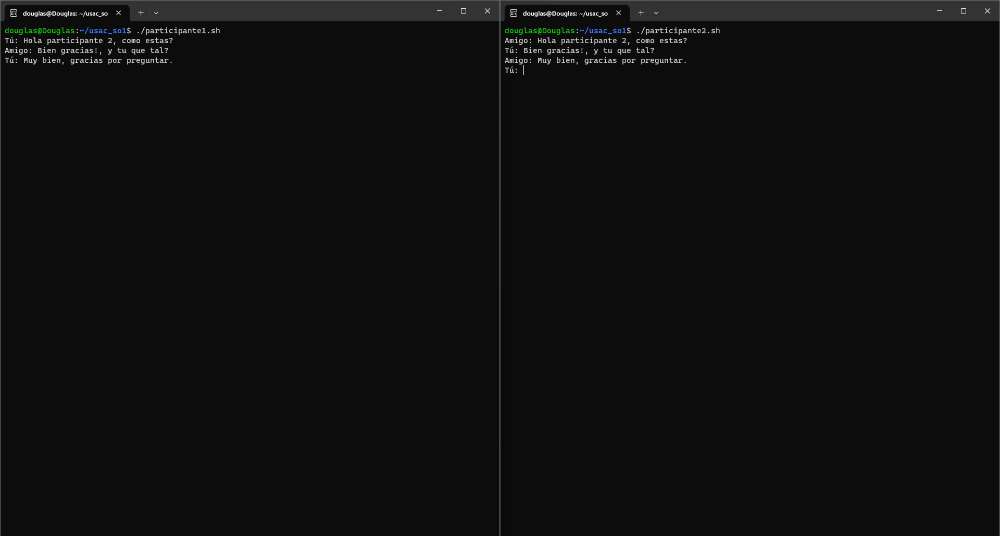

## participante1.sh & participante2.sh

Este script permite que el participante 1 y el participante 2 tengan una comunicación bidireccional a través de un Named Pipe.

### Funciones Principales:

1. **Creación del Named Pipe**

    Si no existe, crea un Named Pipe para la comunicación bidireccional.

    ```bash
    [ -p $PIPE ] || mkfifo $PIPE
    ```

2. **Bucle Principal para Enviar y Recibir Mensajes**

    Lee mensajes ingresados por el usuario y los envía al otro participante mediante el Named Pipe. Espera la respuesta del participante y la muestra en la consola.

    ```bash
    while true; do
        read -p "Tú: " mensaje
        echo "$mensaje" > $PIPE

        # Esperar a que el receptor responda
        respuesta=$(cat $PIPE)
        echo "Amigo: $respuesta"
    done
    ```

3. **Manejo de la Señal de Salida**

    Limpia recursos (elimina el Named Pipe) antes de cerrarse.
    ```bash
    trap cleanup EXIT

    cleanup() {
        rm -f $PIPE
        exit 0
    }
    ```

### Ejecución

